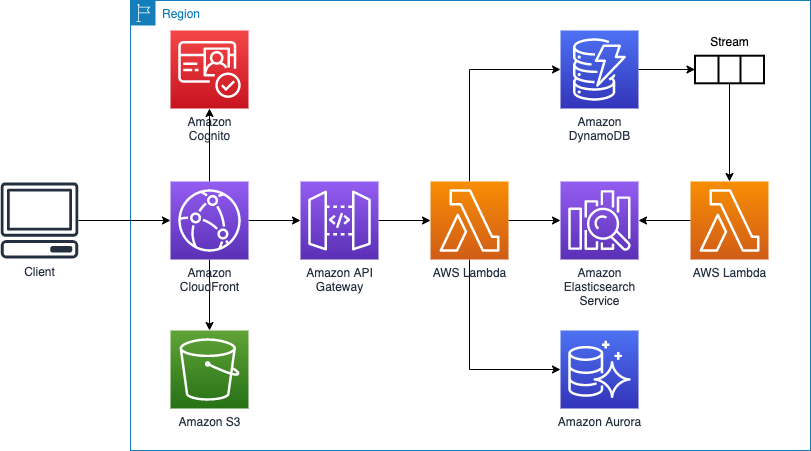
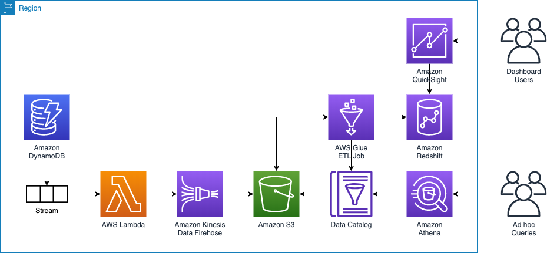
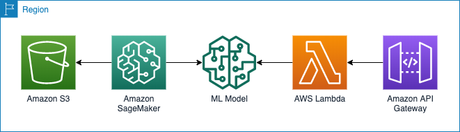

# AWS BikeNow Demo
AWS BikeNow Demo is a sample web application that demonstrates the breadth and depth of database, analytics, and AI/ML services on AWS. The application was built on top of the [AWS Full-Stack Template](https://github.com/awslabs/aws-full-stack-template).

## Overview
The goal of the AWS BikeNow Demo is to help users understand the breadth and depth of the AWS database and analytics portfolio. AWS offers the broadest and deepest portfolio of purpose-built, fully managed database services as well as the most comprehensive, secure, scalable, and cost-effective portfolio of analytics services. With AWS BikeNow Demo, developers can use AWS database and analytics services to manage data through the entirety of its lifecycle, from ingestion, storage, feature engineering, visualization, and analysis in support of data-driven innovation.

## Instructions
The AWS BikeNow Demo is only available in the following AWS Regions: us-east-1 (N. Virginia) and us-west-2 (Oregon).

### Pre-requisites
* [Create and Activate AWS Account](https://aws.amazon.com/premiumsupport/knowledge-center/create-and-activate-aws-account/)
* [See the Troubleshooting section for common issues](#troubleshooting)

**IMPORTANT NOTE:** Creating this demo application in your AWS account will create and consume AWS resources, which will cost money. Be sure to shut down and remove all resources once you are finished to avoid on-going charges to your AWS account (see [instructions on cleaning up](#cleaning-up)).

### Getting Started
To get AWS BikeNow Demo running in your AWS account, follow these steps:
1. Log into the [AWS console](https://console.aws.amazon.com/).
2. Choose one of the **Launch Stack** buttons below for your desired AWS Region.

Region name | Region code | Launch
--- | --- | ---
US East (N. Virginia) | us-east-1 | [](https://console.aws.amazon.com/cloudformation/home?region=us-east-1#/stacks/new?stackName=BikenowDemo&templateURL=https://s3.amazonaws.com/aws-bikenow-demo-us-east-1/master.yaml)
US West (Oregon) | us-west-2 | [](https://console.aws.amazon.com/cloudformation/home?region=us-west-2#/stacks/new?stackName=BikenowDemo&templateURL=https://s3.amazonaws.com/aws-bikenow-demo-us-west-2/master.yaml)

3. From the Cloudformation Create stack page, choose **Next**.
4. You can use the default stack name and parameter values. Choose **Next**.
5. You can use the default stack options and advanced options. Choose **Next**.
6. From the Review page, select:
    * *I acknowledge that AWS CloudFormation might create IAM resources.*
    * *I acknowledge that AWS CloudFormation might create IAM resources with custom names.*
    * *I acknowledge that AWS CloudFormation might require the following capability: CAPABILITY_AUTO_EXPAND*
7. Choose **Create stack**. This step will take ~20-30 minutes to complete.
8. Once the CloudFormation template is finished deploying, sign into your application.
    1. The output of the CloudFormation stack creation will provide a CloudFront URL (in the *Outputs* section of your stack details page).  Copy and paste the CloudFront URL into your browser.
    2. You can sign into your application by registering an email address and a password.  Choose **Sign up to explore the demo** to register.  The registration/login experience is run in your AWS account, and the supplied credentials are stored in Amazon Cognito.  
*Note: given that this is a demo application, we highly suggest that you do not use an email and password combination that you use for other purposes (such as an AWS account, email, or e-commerce site).*
    3. Once you provide your credentials, you will receive a verification code at the email address you provided. Upon entering this verification code, you will be signed into the application.

### Embed a QuickSight Dashboard (Optional)

Follow the [QuickSight tutorial](quicksight/) to embed a QuickSight dashboard in the application.

### Cleaning up

To tear down your application and remove all resources associated with the AWS BikeNow Demo, follow these steps:

1. Log into the AWS CloudFormation Console and find the stack you created for the demo app
2. Delete the stack
    1. Double-check that the S3 buckets created for the stack were successfully removed.

*Remember to shut down/remove all related resources once you are finished to avoid ongoing charges to your AWS account.*

## Troubleshooting

#### 1. Before you can proceed, you must enable a service-linked role to give Amazon ES permissions to access your VPC.

Amazon Elasticsearch Service requires a service-linked role to access your VPC and create network interfaces. Create a service-linked role by running the following AWS CLI command:

```
aws iam create-service-linked-role --aws-service-name es.amazonaws.com
```

## Architecture

### Purpose-Built Databases

Web application assets are stored in a S3 bucket and presented to the user via a CloudFront distribution. Amazon Cognito is used for authentication, and API Gateway and AWS Lambda are used to read and write to backend databases. The core backend databases are Amazon Aurora, Amazon DynamoDB, and Amazon Elasticsearch Service.



DynamoDB provides scalable, low-latency data access for maintaining the status of bike stations. DynamoDB is also used to store review data when a user reads or writes feedback about a bike station. The flexible schema allows us to add features and improve our application with greater agility. As the status of bike stations are updated in DynamoDB, updates are replicated to Amazon Elasticsearch Service. Elasticsearch provides search functionality for users to query bike stations using boolean search operators. When users rent bikes from a station, relational transaction data is stored in Amazon Aurora.

### Data Lake & Analytics

As data is updated in the web application, updates are streamed to a S3 bucket via Amazon Kinesis Data Firehose. AWS Glue Data Catalog stores metadata about the data in S3 and can be used to query the data using other AWS services, including Amazon Athena, Amazon Redshift Spectrum, and Amazon EMR.



Amazon Kinesis Data Firehose provides an easy way to stream data into our data lake on S3. Kinesis Firehose also batches and partitions the data before loading it to S3 so that it can be used effectively by AWS Glue, Athena, and Redshift Spectrum. AWS Glue workflow is used to orchestrate the execution of crawlers and ETL jobs. Crawlers are used to update the Data Catalog, and jobs perform the business logic to extract, transform, and load data to Amazon Redshift for fast, complex data analysis queries. Amazon QuickSight is used to create and publish interactive dashboards using data about bike stations from Redshift. Amazon QuickSight ML Insights leverages machine learning to perform forecasting, anomaly detection, and natural language narratives.

### Machine Learning

As data is accumulated in the data lake, Amazon SageMaker is used to build, train, and deploy machine learning models using historical bike station data.



Amazon SageMaker Notebooks are used to perform analysis on the data in S3 and then build and train ML models. SageMaker also launches the ML instance and deploys the model with a secure endpoint. When a user plans their ride using the web application, API Gateway and AWS Lambda call the model endpoint to generate predictions for the number of bikes available at each station.

### Developer Tools

The code is hosted in AWS CodeCommit. AWS CodePipeline builds the web application using AWS CodeBuild. After successfully building, CodeBuild copies the build artifacts into a S3 bucket where the web application assets are maintained. Along with uploading to Amazon S3, CodeBuild invalidates the cache so users always see the latest experience when accessing the storefront through the Amazon CloudFront distribution. AWS CodeCommit. AWS CodePipeline, and AWS CodeBuild are used in the deployment and update processes only, not while the application is in a steady-state of use.

## Conclusion

AWS offers the broadest and deepest portfolio of purpose-built, fully managed database and analytics services. AWS BikeNow Demo showcases how AWS enables us to build data-driven applications and turn data into insights.

For more information on AWS database and analytics services, see:
* [Databases on AWS](https://aws.amazon.com/products/databases/)
* [Data Lakes and Analytics on AWS](https://aws.amazon.com/big-data/datalakes-and-analytics/)
