# Embed a QuickSight Dashboard

Follow these steps to create analyses with QuickSight and embed a dashboard in the application.

## Create VPC Endpoints

### Create a Redshift VPC Endpoint

1. Open the [Amazon QuickSight console](https://us-east-1.quicksight.aws.amazon.com/sn/start).
2. From the upper right-hand corner, choose on the user icon and choose **Manage QuickSight**.

  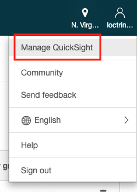

3. From the left-hand navigation panel, choose **Manage VPC connections**.
4. Choose **Add VPC connection**.
5. For **VPC connection name**, enter a name for your VPC connection (e.g., `BikeDemoRedshiftVpcConn`)
6. For **VPC ID**, select the VPC named `Bike demo Redshift VPC`.
7. For **Subnet ID**, select the `PrivateSubnet` value from the CloudFormation Outputs.
8. For **Security group ID**, enter the `RedshiftSecurityGroup` value from the CloudFormation Outputs.
9. Choose **Create**.

  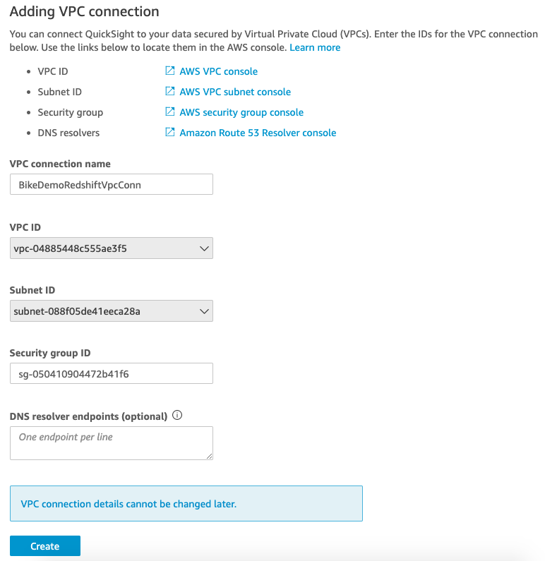

### Create an Aurora VPC Endpoint

1. Return to the [Amazon QuickSight console](https://us-east-1.quicksight.aws.amazon.com/sn/start).
2. From the upper right-hand corner, choose on the user icon and choose **Manage QuickSight**.
3. From the left-hand navigation panel, choose **Manage VPC connections**.
4. Choose **Add VPC connection**.
5. For **VPC connection name**, enter a name for your VPC connection (e.g., `BikeDemoAuroraVpcConn`)
6. For **VPC ID**, select the VPC named `Bike demo Aurora VPC`.
7. For **Subnet ID**, select the `PrivateSubnet` value from the CloudFormation Outputs.
8. For **Security group ID**, enter the `DbSecurityGroup` value from the CloudFormation Outputs.
9. Choose **Create**.

  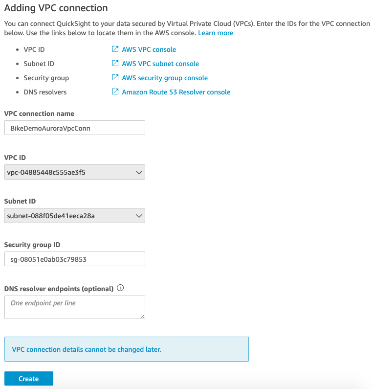

## Create data sources

### Create a Redshift data source

1. Return to the [Amazon QuickSight console](https://us-east-1.quicksight.aws.amazon.com/sn/start).
2. From the upper right-hand corner, choose **Manage data**.

  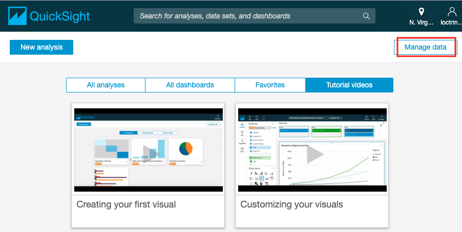

3. Choose **New data set**.
4. Select **Redshift - Manual connect**.
5. For **Data source name**, enter a name for your data source (e.g., `Bike Demo Redshift`)
6. For **Connection type**, select your Redshift VPC connection (i.e., `BikeDemoRedshiftVpcConn`).
7. For the following parameters, retrieve values from [Secrets Manager](https://console.aws.amazon.com/secretsmanager/home).
    1. **Database server:** *host*
    2. **Port:** *port*
    3. **Database name:** *dbname*
    4. **Username:** *username*
    5. **Password:** *password*
8. Choose **Create data source**.

  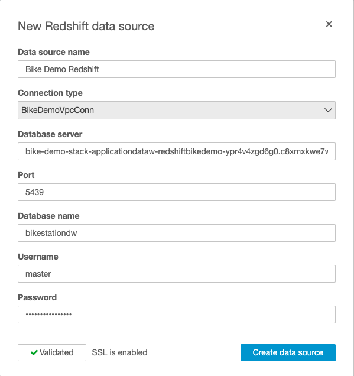

9. Select the *public* schema and a table and choose **Edit/Preview data** or choose **Use custom SQL** to write your own query.

  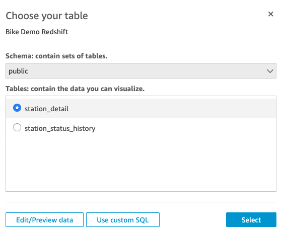

10. Select *Import to SPICE for quicker analytics* or *Directly query your data* and choose **Edit/Preview data** to preview data.
11. After you are finished previewing the data, give your data set a name and choose **Save & Visualize**.

### Create an Aurora MySQL data source

1. Return to the [Amazon QuickSight console](https://us-east-1.quicksight.aws.amazon.com/sn/start).
2. From the upper right-hand corner, choose **Manage data**.
3. Choose **New data set**.
4. Select **Aurora**.
5. For **Data source name**, enter a name for your data source (e.g., `Bike Demo Aurora`)
6. For **Connection type**, select your Aurora VPC connection (i.e., `BikeDemoAuroraVpcConn`).
7. For **Database connector**, select **MySQL**.
8. For the following parameters, retrieve values from [Secrets Manager](https://console.aws.amazon.com/secretsmanager/home).
    1. **Database server:** *host*
    2. **Port:** *port*
    3. **Database name:** *dbname*
    4. **Username:** *username*
    5. **Password:** *password*
8. Choose **Create data source**.

  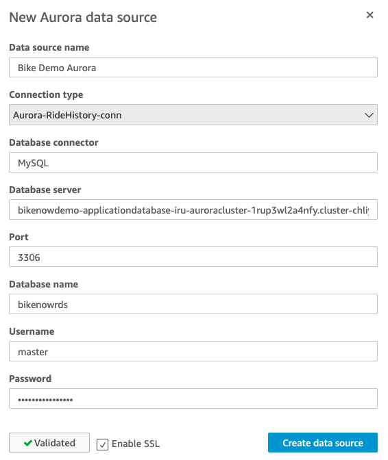

9. Select a table and choose **Edit/Preview data** or choose **Use custom SQL** to write your own query.

  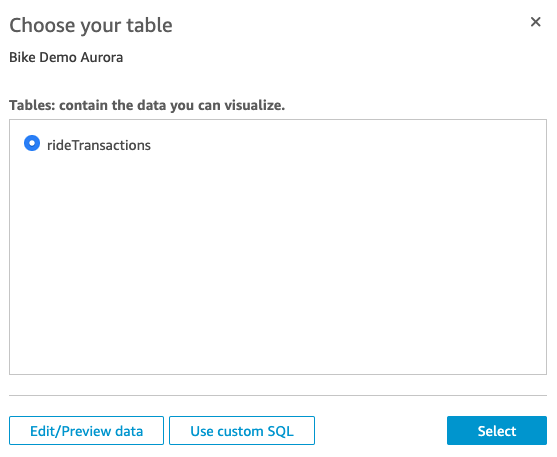

10. Select *Import to SPICE for quicker analytics* or *Directly query your data* and choose **Edit/Preview data** to preview data.
11. After you are finished previewing the data, give your data set a name and choose **Save & Visualize**.


## Create a Dashboard

### Create an Analysis

1. Return to the [Amazon QuickSight console](https://us-east-1.quicksight.aws.amazon.com/sn/start).
2. From the upper left-hand corner, choose **New analysis**.
3. Choose a data source that you created in previous steps.
4. Choose **Create analysis**.

You can now create an analysis using your data sets. For more information on creating your analysis, see: [Working with Analyses](https://docs.aws.amazon.com/quicksight/latest/user/working-with-analyses.html).

You can add multiple data sets to your analysis. For more information, see: [Adding a Data Set to an Analysis](https://docs.aws.amazon.com/quicksight/latest/user/adding-a-data-set-to-an-analysis.html).

<details>
  <summary>Expand to see sample query.</summary>

The following query will get the last reported number of bikes available and the capacity of each station:
```
WITH cte AS
(
  SELECT
  	ROW_NUMBER() OVER (PARTITION BY station_id ORDER BY last_reported DESC) AS rn
  	,station_id
  	,num_bikes_available
  	,is_installed
  	,is_returning
  	,is_renting
  	,last_reported
  FROM public.station_status_history
)
SELECT
  cte.station_id
  ,s.station_name
  ,cte.num_bikes_available
  ,cte.is_installed
  ,cte.is_returning
  ,cte.is_renting
  ,s.capacity
  ,s.lat
  ,s.lon
  ,cte.last_reported
  ,s.last_updated
FROM
  cte
  INNER JOIN public.station_detail s ON cte.station_id = s.station_id
WHERE rn = 1;
```
</details>

### Publish Dashboard

1. Open the analysis that you created in previous steps.
2. Choose **Share** on the application bar, and then choose **Publish dashboard**.

  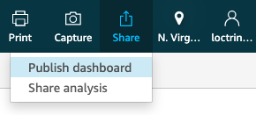

3. Select **Publish new dashboard as**, and then provide a dashboard name.
4. Choose **Publish dashboard**.

  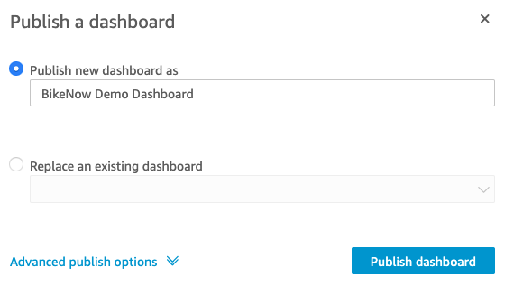

5. Select **Share with all users in this account** and choose **Confirm**.

  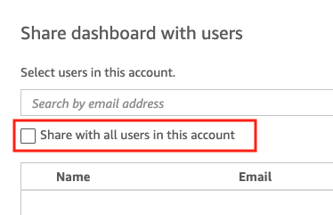

  ***NOTE:** All users in the QuickSight account will have reader access to this dashboard. For more information on managing access to your dashboard, see: [Share Dashboards](https://docs.aws.amazon.com/quicksight/latest/user/sharing-a-dashboard.html)*

6. From the **Manage dashboard sharing** prompt, choose the **X** in the upper right-hand corner to close the prompt.
7. While viewing the dashboard, the URL in your browser location bar will be in the following format: `https://{REGION}.quicksight.aws.amazon.com/sn/dashboards/XXXXXXXX-XXXX-XXXX-XXXXXXXXXXXX`. The characters after the final `/` in the URL is your *Dashboard ID*. Copy the *Dashboard ID* into a text editor of your choice for the next steps.

## Embed a QuickSight Dashboard

### Update Embed URL Lambda Function

1. Open the [AWS Lambda Console](https://console.aws.amazon.com/lambda/home), and choose **Applications** from the left-hand navigation menu.
2. Choose the application with the description *Template to create BikeNow purpose-built database demo*.
3. Type `GetEmbeddedQSUrl` in the filter textbox and submit.

  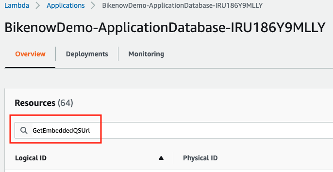

4. Choose the Lambda function with the **Logical ID** of *LambdaGetEmbeddedQSUrlApi* to open the AWS Lambda console editor.
5. Locate the **Environment variables** section and choose **Edit**.

  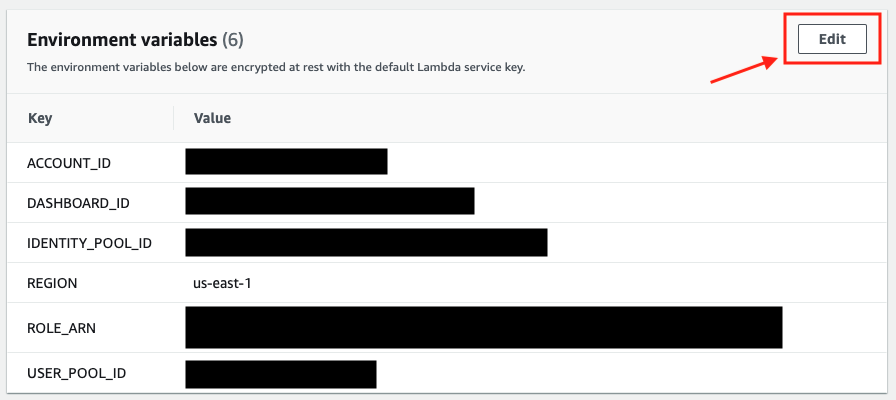

6. In the **Value** column next to the `DASHBOARD_ID` key, replace `<dashboard-id>` with the *Dashboard ID* that you copied from previous steps. Your *Dashboard ID* should have the following format: `XXXXXXXX-XXXX-XXXX-XXXXXXXXXXXX`.
10. Choose **Save**.

### Update Web Application Code

1. Open the [CodeCommit Console](https://console.aws.amazon.com/codesuite/codecommit/home)
2. Choose the **Bikenow-WebAssets** repository.
3. Navigate to the file `/src/App.tsx`, and choose **Edit**.

  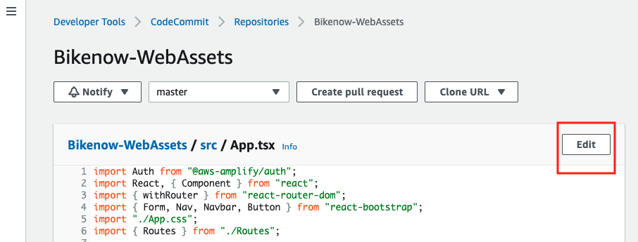

4. Uncomment the *Report* button at *Line 67*. Your code should like the following:

  ```
  showLoggedInBar = () => (
    <Form inline>
      <Button variant="outline-light" href="/rides" className="mr-sm-2 uniform-width">Rides</Button>
      <Button variant="outline-light" href="/reviews" className="mr-sm-2 uniform-width">Reviews</Button>
      <Button variant="outline-light" href="/report" className="mr-sm-2 uniform-width">Report</Button>
      <Button variant="outline-light" onClick={this.handleLogout} className="uniform-width">Log out</Button>
    </Form>
  );
  ```

5. Below the code editor, provide an author name and email address and choose **Commit changes**.
6. Open the [CodePipeline Console](https://console.aws.amazon.com/codesuite/codepipeline/pipelines).
7. Once your Pipeline status is **Succeeded**, you can view your dashboard in the web application.

### Test your application

1. Using your browser, navigate to the `WebsiteURL` value from the CloudFormation Outputs.
2. If you are not signed in, register and sign into your application.
3. Choose **Report** from the upper right-hand navigation bar.

  ***NOTE:** You may need to perform a hard refresh to clear your browser's cache and see updates.**

  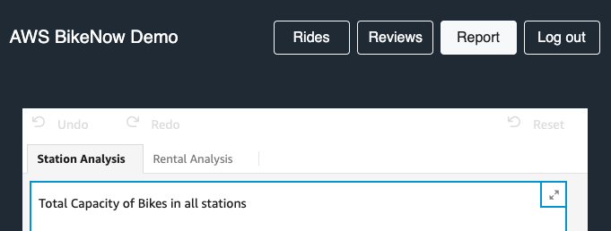

## Conclusion

Congratulations! You have embedded a QuickSight dashboard in your application.

For more information on embedding dashboards, see: [Embedding Amazon QuickSight Dashboards](https://docs.aws.amazon.com/quicksight/latest/user/embedding-dashboards.html).
